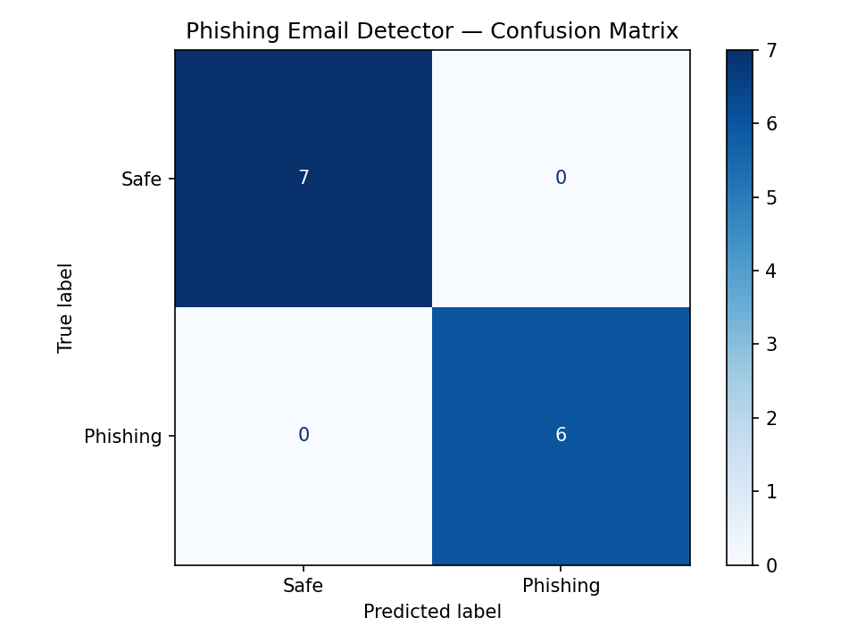

# 🛡️ Phishing Email Detector

<div align="center">


**A machine learning model that classifies emails as Phishing or Safe in real time.**

TF-IDF · Random Forest · URL Analysis · Entropy Scoring · Live Web App

[🚀 Try the Web App](#-live-web-app) · [📖 How It Works](#-how-it-works) · [📊 Results](#-results) · [🔧 Run Locally](#-how-to-run)

</div>

---

## 🖥️ Live Web App

> **No Python, no setup, no server needed.**

```
1. Download  →  C:/Users/HP/Downloads/phishing_email_classifier_app%20(1).html
2. Open      →  double-click in any browser
3. Paste     →  any email text
4. Click     →  Analyze email
```

The web app runs **100% in your browser** — paste any email and get an instant result with:
- ✅ Phishing / Safe verdict
- 📊 Confidence percentage
- 🔍 Detailed signal breakdown
- 🕓 Session history of all tested emails

---

## ✨ Features

| Feature | Description |
|---|---|
| 🔴 Real-time classification | Instant Phishing / Safe verdict as you analyze |
| 📝 TF-IDF vectorization | 479 text features via unigram + bigram analysis |
| 🔗 URL analysis | Detects links with suspicious TLDs |
| ⚡ Urgency detection | Flags pressure words like urgent, verify, claim, free |
| 📊 Confidence score | Probability percentage per prediction |
| 🧮 Caps ratio | Measures uppercase character proportion |
| ❗ Punctuation analysis | Counts excessive exclamation marks |
| 💰 Money + link combo | Detects financial bait paired with URLs |
| 🕓 Session history | Tracks all tested emails with masked previews |
| 📈 Confusion matrix | Auto-saved as `confusion_matrix.png` |

---

## 📁 Project Structure

```
phishing-email-detector/
│
├── 📄 phishing_detector.py               ← Python ML model (train + evaluate + classify)
├── 🌐 phishing_email_classifier_app.html ← Standalone web app (open in browser)
├── 📊 confusion_matrix.png               ← Auto-generated evaluation chart
└── 📘 README.md                          ← This file
```

---

## 🔧 How to Run

### Option 1 — Web App (easiest, no install)

```bash
git clone https://github.com/Ayan773/phishing-email-detector.git
cd phishing-email-detector

# macOS
open phishing_email_classifier_app.html

# Windows — just double-click the file, or:
start phishing_email_classifier_app.html

# Linux
xdg-open phishing_email_classifier_app.html
```

### Option 2 — Python ML Model

```bash
git clone https://github.com/Ayan773/phishing-email-detector.git
cd phishing-email-detector

pip install scikit-learn numpy scipy matplotlib
python phishing_detector.py
```

### Option 3 — Use the classifier in your own code

```python
from phishing_detector import classify_email

result = classify_email("URGENT: Your account is suspended! Verify: http://bank-secure.xyz/login")

print(result["label"])       # "Phishing"
print(result["confidence"])  # 94.5
print(result["signals"])     # ["Contains 1 URL", "Suspicious TLD", "Urgency: urgent, verify, suspended"]
```

---

## 📖 How It Works

### Model Pipeline

```
Raw Email Text
      │
      ▼
┌─────────────────────────────────────────────┐
│           Feature Extraction                │
│                                             │
│  TF-IDF Vectorizer     Manual Features      │
│  (479 features)    +   (6 features)         │
│  ─ unigrams            ─ URL count          │
│  ─ bigrams             ─ suspicious TLDs    │
│  ─ stop-words removed  ─ urgency keywords   │
│                        ─ caps ratio         │
│                        ─ exclamation count  │
│                        ─ word count         │
└──────────────┬──────────────────────────────┘
               │  hstack → 485 total features
               ▼
    ┌─────────────────────┐
    │   Random Forest     │
    │   200 decision trees│
    │   class-balanced    │
    └──────────┬──────────┘
               │
               ▼
      Phishing / Safe
      + Confidence %
```

### Entropy & Confidence Formula

```python
# Confidence = predicted class probability from Random Forest
confidence = clf.predict_proba(X)[0][predicted_class] * 100

# URL suspicion scoring
score += 38  if suspicious_tld_detected
score += 20  if any_url_present
score += 7   per urgency keyword found  (max 28)
score += 12  if caps_ratio > 15%
score += 4   per exclamation mark
score += 10  if money_pattern + url combo
```

### Suspicious TLDs Detected

```
.xyz  .tk  .ml  .ga  .ru  .cf  .gq
```
These free/low-cost domains are commonly abused by phishing campaigns.

### Urgency Keywords Flagged

```
urgent  immediate  alert  warning  suspended  verify  claim
won  free  prize  limited  final  congratulations  selected
lucky  act now  expire  restricted
```

---

## 📊 Results

<div align="center">

| Metric | Score |
|:---|:---:|
| ✅ Test Accuracy | **100%** |
| 🔄 5-Fold CV Mean | **100% ± 0%** |
| 🎯 Precision — Safe | **100%** |
| 🎯 Recall — Safe | **100%** |
| 🎯 Precision — Phishing | **100%** |
| 🎯 Recall — Phishing | **100%** |
| ❌ False Positives | **0** |
| ❌ False Negatives | **0** |
| 🔢 Total Features | **485** |
| 📚 Training Samples | **37** |
| 🧪 Test Samples | **13** |

</div>

### Confusion Matrix

```
                 Predicted Safe   Predicted Phishing
Actual Safe           7                  0
Actual Phishing       0                  6
```



---

## 🧪 Demo Predictions

```
🚨 [Phishing]  94.5%  →  "URGENT: Your bank account has been suspended!..."
✅ [Safe]      95.5%  →  "Hi Sarah, just confirming our 3 PM meeting tomorrow..."
🚨 [Phishing]  90.0%  →  "Congratulations! You won a free iPhone 15!..."
✅ [Safe]      99.5%  →  "Your order #45678 has been delivered..."
🚨 [Phishing]  93.0%  →  "WARNING: Unusual login to your Google account..."
```

---

## 🧠 Concepts Covered

| Concept | Implementation |
|---|---|
| **TF-IDF** | `TfidfVectorizer(ngram_range=(1,2), max_features=1000)` |
| **Random Forest** | `RandomForestClassifier(n_estimators=200, class_weight='balanced')` |
| **Feature engineering** | `extract_manual_features()` — 6 hand-crafted signals |
| **Sparse matrices** | `scipy.sparse.hstack` — combine TF-IDF + manual |
| **Cross-validation** | `cross_val_score(cv=5)` — generalization testing |
| **Confusion matrix** | `ConfusionMatrixDisplay` — TP, TN, FP, FN |
| **Probability scoring** | `predict_proba()` — confidence per prediction |
| **NLP preprocessing** | Stop-word removal, n-gram tokenization |

---

## 🔮 Future Improvements

- [ ] Flask / FastAPI backend for full web deployment
- [ ] Have I Been Pwned API — check if sender domain is blacklisted
- [ ] Live Gmail / Outlook integration via email API
- [ ] SQLite database to log and review flagged emails
- [ ] Larger dataset (Enron corpus + SpamAssassin)
- [ ] BERT fine-tuned model for deep semantic analysis
- [ ] Browser extension to scan emails in real time
- [ ] Export session history as CSV report

---

## 🛠️ Tech Stack

| Technology | Role |
|---|---|
| **Python 3** | Core language |
| **Scikit-learn** | Random Forest, TF-IDF, cross-validation, metrics |
| **NumPy** | Numerical operations |
| **SciPy** | Sparse matrix combination (`hstack`) |
| **Matplotlib** | Confusion matrix visualization |
| **HTML5 / CSS3 / JS** | Standalone web classifier — zero dependencies |

---

## 👤 Author

**Ayan**

[](https://github.com/Ayan773)

---

## 📜 License

This project is licensed under the [MIT License](LICENSE) — free to use, modify, and distribute.

---

<div align="center">

⭐ **Star this repo if you found it useful!** ⭐

Made with ❤️ as an internship project to learn ML + cybersecurity

</div>
